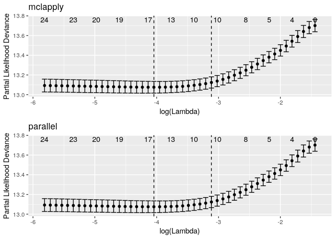

glmnet (averissimo fork)
================

-   [Load data from package itself](#load-data-from-package-itself)
-   [Register doMC cores for classic glmnet package](#register-domc-cores-for-classic-glmnet-package)
-   [Benchmark between glmnet and glmnet.mclapply](#benchmark-between-glmnet-and-glmnet.mclapply)
-   [Testing if results are the same](#testing-if-results-are-the-same)
-   [Plot the cross-validation](#plot-the-cross-validation)
-   [Session Information](#session-information)

``` r
library(microbenchmark)
library(devtools)
library(futile.logger)
library(testthat)
library(doMC)
library(ggfortify)
library(glmnet)
devtools::load_all()
```

This is a fork that implements mclapply instead of foreach in cv.glmnet. With gains when adding parallization to `cv.coxnet`.

The big improvement that can be seen in the tests below, is when adding `mclapply` in `cv.coxnet` for calculating deviances.

Load data from package itself
-----------------------------

``` r
data("CoxExample")
flog.info('x', head(x), capture = TRUE)
```

    ## INFO [2018-08-28 10:11:09] x
    ## 
    ##            [,1]       [,2]        [,3]       [,4]        [,5]       [,6]
    ## [1,] -0.8767670 -0.6135224 -0.56757380  0.6621599  1.82218019 -1.0906678
    ## [2,] -0.7463894 -1.7519457  0.28545898  1.1392105  0.80178007  1.8501985
    ## [3,]  1.3759148 -0.2641132  0.88727408  0.3841870  0.05751801 -1.0917341
    ## [4,]  0.2375820  0.7859162 -0.89670281 -0.8339338 -0.58237643  0.1874136
    ## [5,]  0.1086275  0.4665686 -0.57637261  1.7041314  0.32750715 -0.1211972
    ## [6,]  1.2027213 -0.4187073 -0.05735193  0.5948491  0.44328682 -0.1191545
    ##             [,7]       [,8]        [,9]      [,10]       [,11]      [,12]
    ## [1,] -0.33186564  3.6754612  0.24580798  1.1382203 -0.45973434 -0.6180683
    ## [2,]  0.30663005 -1.3729036 -0.03249051  0.7477848 -0.89912758  0.2816860
    ## [3,]  0.82119791  2.2960618 -0.44769567 -0.3046003 -3.68163918  1.3127756
    ## [4,] -0.58595131  0.4762090 -0.60580025 -1.2703322  0.86752747 -0.4834246
    ## [5,]  0.88537209  0.4505604  0.58878157  0.5504976  0.55170784 -1.1049931
    ## [6,]  0.08097645  0.1645867  0.35648515  0.7186709 -0.04880648  1.3631580
    ##           [,13]      [,14]      [,15]      [,16]       [,17]      [,18]
    ## [1,]  0.3654053 -1.3650385  1.7898937 -0.5999495  0.07116521 -1.1068962
    ## [2,]  1.5417457  0.2219214 -0.4466419  1.8079912  1.54098724  1.7619702
    ## [3,] -1.8636989 -0.2044196  0.8885817 -0.3963045  0.54961165  0.1629438
    ## [4,] -0.1010839  0.9420437 -0.2348138  0.2621202  0.45862954  0.3885563
    ## [5,]  1.5983735 -0.3391697 -0.5006777 -1.2052308 -1.96005404 -0.7694754
    ## [6,] -0.6124422 -1.6594020 -0.2872386  0.9683834 -0.83491461 -0.5673414
    ##           [,19]      [,20]      [,21]      [,22]       [,23]      [,24]
    ## [1,]  1.0467646  0.0846883  0.8699009 -0.4862156  0.23313891 -0.8902209
    ## [2,] -0.9106351  0.1854289 -0.4429407 -0.1356272  0.17755123 -0.1209084
    ## [3,] -2.4504853 -1.3069008  0.3925106  1.1122054  0.00555102 -1.4621795
    ## [4,] -1.5391489 -0.5914468 -0.8136730 -1.1984657  0.74974928 -0.9831296
    ## [5,]  0.7144812  1.2637391  0.1603489 -1.0625900  1.71650170 -0.2222816
    ## [6,]  0.7863190 -0.3343750 -0.4237433 -0.5998976 -0.72813688 -1.7928807
    ##           [,25]      [,26]       [,27]      [,28]      [,29]       [,30]
    ## [1,]  1.5371081  0.3620787 -0.05175784 -0.1783899  0.9447754  1.77496688
    ## [2,]  1.0110951  0.9778248  0.90526762 -1.4243355 -0.7334893 -0.05692325
    ## [3,] -1.2998127 -2.7680914 -0.16716127 -0.6997792  0.9285742 -1.56113648
    ## [4,]  2.0045957 -0.5707114 -0.23549099  0.9390039  0.3634077  0.54857540
    ## [5,]  0.7853629 -0.6134820  1.26367728 -1.8008181 -1.5882571  1.00869790
    ## [6,] -1.3879823 -1.7141769 -0.19156886 -0.9339565  0.2559535 -1.38194415

``` r
flog.info('y', head(y), capture = TRUE)
```

    ## INFO [2018-08-28 10:11:09] y
    ## 
    ##            time status
    ## [1,] 1.76877757      1
    ## [2,] 0.54528404      1
    ## [3,] 0.04485918      0
    ## [4,] 0.85032298      0
    ## [5,] 0.61488426      1
    ## [6,] 0.29860939      0

Register doMC cores for classic glmnet package
----------------------------------------------

``` r
registerDoMC(cores=params$n.cores)
```

Benchmark between glmnet and glmnet.mclapply
--------------------------------------------

``` r
microbenchmark::microbenchmark(
  glmnet.mclapply.no.parallel = glmnet.mclapply::cv.glmnet(x,y, family = 'cox'),
  glmnet.mclapply.with.parallel = glmnet.mclapply::cv.glmnet(x,y, family = 'cox', mc.cores = params$n.cores),
  glmnet.no.parallel = glmnet::cv.glmnet(x,y, family = 'cox'),
  glmnet.with.parallel = glmnet::cv.glmnet(x,y, family = 'cox', parallel=TRUE),
  times = 5)
```

    ## Unit: milliseconds
    ##                           expr      min       lq     mean   median
    ##    glmnet.mclapply.no.parallel 514.3257 522.7022 615.2583 535.6731
    ##  glmnet.mclapply.with.parallel 219.0708 220.5070 226.3172 223.2483
    ##             glmnet.no.parallel 501.9828 508.7392 517.7798 522.1184
    ##           glmnet.with.parallel 320.5860 332.7786 332.8359 334.3450
    ##        uq      max neval cld
    ##  660.1404 843.4499     5   b
    ##  227.0549 241.7050     5  a 
    ##  526.1336 529.9248     5   b
    ##  336.9596 339.5104     5  a

Testing if results are the same
-------------------------------

*note*: There will be errors if this fails

``` r
set.seed(1985)
res.mcl <- glmnet.mclapply::cv.glmnet(x,y, family = 'cox', mc.cores = 10)
set.seed(1985)
res.prl <- glmnet::cv.glmnet(x,y, family = 'cox', parallel=TRUE)

expect_equal(res.mcl$lambda.min, res.prl$lambda.min)
expect_equal(res.mcl$lambda.1se, res.prl$lambda.1se)
expect_equal(res.mcl$lambda, res.prl$lambda)

expect_equal(res.mcl$cvm, res.prl$cvm)
expect_equal(res.mcl$cvsd, res.prl$cvsd)
expect_equal(coef(res.mcl, 'lambda.min'), coef(res.prl, 'lambda.min'))

expect_equal(res.mcl$glmnet.fit$beta, res.prl$glmnet.fit$beta)

futile.logger::flog.info('Sucess!! results are the same')
```

    ## INFO [2018-08-28 10:11:19] Sucess!! results are the same

Plot the cross-validation
-------------------------



Session Information
===================

    ## R version 3.5.0 (2018-04-23)
    ## Platform: x86_64-pc-linux-gnu (64-bit)
    ## Running under: Debian GNU/Linux 9 (stretch)
    ## 
    ## Matrix products: default
    ## BLAS: /usr/lib/openblas-base/libblas.so.3
    ## LAPACK: /usr/lib/libopenblasp-r0.2.19.so
    ## 
    ## locale:
    ##  [1] LC_CTYPE=en_US.UTF-8       LC_NUMERIC=C              
    ##  [3] LC_TIME=en_US.UTF-8        LC_COLLATE=en_US.UTF-8    
    ##  [5] LC_MONETARY=en_US.UTF-8    LC_MESSAGES=C             
    ##  [7] LC_PAPER=en_US.UTF-8       LC_NAME=C                 
    ##  [9] LC_ADDRESS=C               LC_TELEPHONE=C            
    ## [11] LC_MEASUREMENT=en_US.UTF-8 LC_IDENTIFICATION=C       
    ## 
    ## attached base packages:
    ## [1] parallel  stats     graphics  grDevices utils     datasets  methods  
    ## [8] base     
    ## 
    ## other attached packages:
    ##  [1] glmnet.mclapply_2.0-16 glmnet_2.0-16          Matrix_1.2-14         
    ##  [4] ggfortify_0.4.5        ggplot2_3.0.0          doMC_1.3.5            
    ##  [7] iterators_1.0.10       foreach_1.4.4          testthat_2.0.0        
    ## [10] futile.logger_1.4.3    devtools_1.13.6        microbenchmark_1.4-4  
    ## 
    ## loaded via a namespace (and not attached):
    ##  [1] zoo_1.8-3            tidyselect_0.2.4     purrr_0.2.5         
    ##  [4] splines_3.5.0        lattice_0.20-35      colorspace_1.3-2    
    ##  [7] htmltools_0.3.6      yaml_2.2.0           survival_2.42-6     
    ## [10] rlang_0.2.2          pillar_1.3.0         glue_1.3.0          
    ## [13] withr_2.1.2          lambda.r_1.2.3       bindrcpp_0.2.2      
    ## [16] multcomp_1.4-8       plyr_1.8.4           bindr_0.1.1         
    ## [19] stringr_1.3.1        munsell_0.5.0        commonmark_1.5      
    ## [22] gtable_0.2.0         loose.rock_1.0.5     mvtnorm_1.0-8       
    ## [25] codetools_0.2-15     memoise_1.1.0        evaluate_0.11       
    ## [28] labeling_0.3         knitr_1.20           TH.data_1.0-9       
    ## [31] Rcpp_0.12.18         scales_1.0.0         backports_1.1.2     
    ## [34] formatR_1.5          gridExtra_2.3        digest_0.6.16       
    ## [37] stringi_1.2.4        dplyr_0.7.6          grid_3.5.0          
    ## [40] rprojroot_1.3-2      tools_3.5.0          sandwich_2.5-0      
    ## [43] magrittr_1.5         lazyeval_0.2.1       tibble_1.4.2        
    ## [46] futile.options_1.0.1 crayon_1.3.4         tidyr_0.8.1         
    ## [49] pkgconfig_2.0.2      MASS_7.3-50          xml2_1.2.0          
    ## [52] assertthat_0.2.0     rmarkdown_1.10       roxygen2_6.1.0      
    ## [55] R6_2.2.2             compiler_3.5.0
